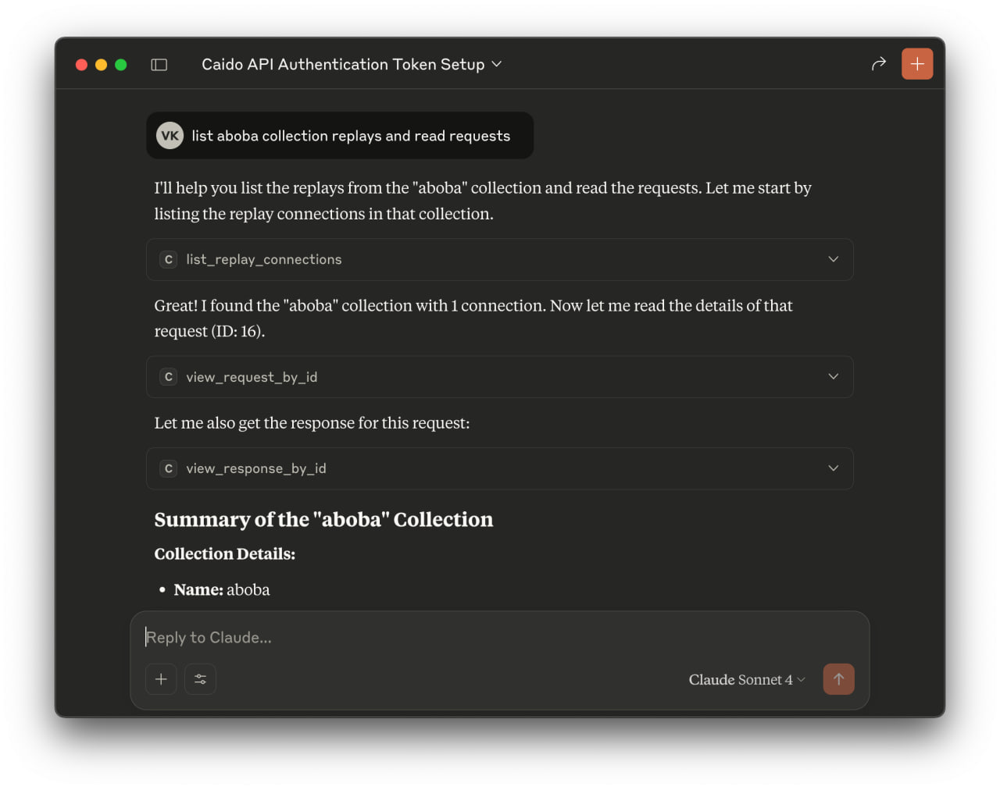
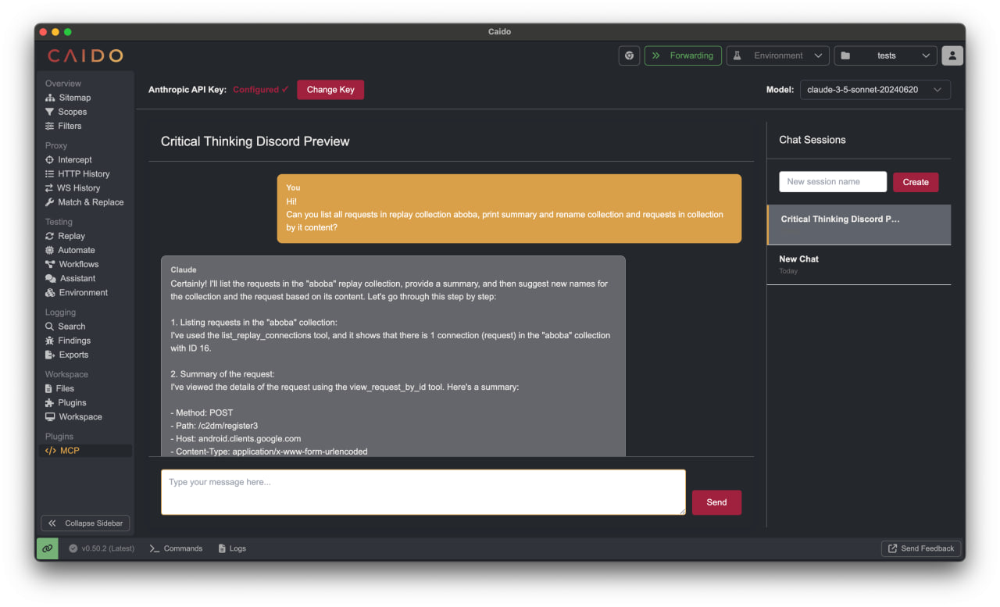

# Ebka AI

<div align="center">

_A powerful AI-powered assistant for Caido web application security testing, built with Claude AI_

[](https://github.com/Slonser/Ebka-Caido-AI/network/members)
[](https://github.com/Slonser/Ebka-Caido-AI/issues)
[](https://github.com/Slonser/Ebka-Caido-AI/releases)
[](https://github.com/Slonser/Ebka-Caido-AI/stargazers)
[](https://github.com/Slonser/Ebka-Caido-AI/blob/main/LICENSE)

[Report Bug](https://github.com/Slonser/Ebka-Caido-AI/issues) •
[Request Feature](https://github.com/Slonser/Ebka-Caido-AI/issues)


*Claude Desktop Integration*

</div>

---

- [Ebka AI](#ebka-ai)
  - [Overview](#overview)
  - [Features](#features)
  - [Prerequisites](#prerequisites)
  - [Getting Started](#getting-started)
    - [Method 1 - Claude Desktop (Extension Required)](#method-1---claude-desktop-extension-required)
    - [Method 2 - Direct API Access (Requires API Key)](#method-2---direct-api-access-requires-api-key)
  - [Installation](#installation)
    - [Prerequisites](#prerequisites-1)
    - [Install from source:](#install-from-source)
  - [Usage](#usage)
  - [Contributing](#contributing)
  - [License](#license)

## Overview

Ebka AI is an AI-powered assistant that integrates seamlessly with Caido, providing intelligent security testing capabilities through natural language commands and automated workflows. Built with Claude AI, it offers advanced HTTPQL query search, match/replace operations, replay session management, and AI-powered security analysis.

---

## Features
More 19+ Claude tools:

- **HTTPQL Query Search**: Search through requests using HTTPQL syntax for efficient filtering and analysis
- **Match/Replace Operations**: Edit Math/Replace rules with sophisticated find and replace operations
- **Replay Sessions & Collections**: Execute and manage replay sessions and replay collections for automated testing
- **Request Sending**: Send custom HTTP requests with full control over headers, body, and parameters
- **Create Findings**: Create Findings based on security analysis
- **AI-Powered Analysis**: Leverage Claude AI for intelligent security testing insights and automation

## Prerequisites

- [Caido](https://caido.io/) web application security testing platform
- For Direct Usage: Claude API key from [Anthropic Console](https://console.anthropic.com/settings/keys)

---

## Getting Started

There are two ways to interact with the Caido AI Assistant:

### Method 1 - Claude Desktop (Extension Required)

1. **Download the extension** for Claude Desktop
2. **Add to claude_desktop_config**:
   ```json
   {
     "mcpServers": {
       "caido": {
         "command": "node",
         "args": ["/path/to/claude-mcp-server/build/index.js"]
       }
     }
   }
   ```
3. **Click "Copy MCP Request"** in the Caido plugin tab
4. **Paste the request** in Claude to set the accessKey and API URL
5. **Congratulations!** You can now communicate with Caido through Claude


*Claude Desktop Integration*

### Method 2 - Direct API Access (Requires API Key)

1. **Enter your API KEY** in the plugin tab
2. **Use the functionality directly** from Caido without Claude Desktop


*Direct Caido Integration*

---

## Installation

### Prerequisites

- Caido (latest version)
- Node.js and pnpm (for development)

### Install from source:

1. **Clone the repository:**
   ```bash
   git clone https://github.com/Slonser/Ebka-Caido-AI.git
   cd Ebka-Caido-AI
   ```

2. **Install dependencies:**
   ```bash
   pnpm install
   ```

3. **Build the project:**
   ```bash
   pnpm build
   ```

4. **Install in Caido:**
   - Open Caido
   - Go to Settings > Plugins
   - Click "Install from file"
   - Select the built plugin file from the appropriate directory

---

## Usage

1. **Access Ebka AI:**
   - After installation, find "Ebka AI" in your Caido sidebar
   - Click to open the AI assistant interface

2. **Configure your settings:**
   - Enter your Claude API key for direct usage
   - Configure Claude Desktop integration if using the extension
   - Set up your preferred security testing workflows

3. **Use AI-powered features:**
   - Ask natural language questions about your security testing
   - Use HTTPQL queries to search through requests
   - Create and manage match/replace rules
   - Execute replay sessions and collections
   - Generate security findings with AI assistance

---

## Contributing

1. Fork the repository
2. Create your feature branch (`git checkout -b feature/amazing-feature`)
3. Commit your changes (`git commit -m 'Add some amazing feature'`)
4. Push to the branch (`git push origin feature/amazing-feature`)
5. Open a Pull Request

---

## License

This project is licensed under the GPL-3.0 License - see the [LICENSE](LICENSE) file for details.

---

<div align="center">
Made with ❤️ for the Caido community and security researchers
</div>


